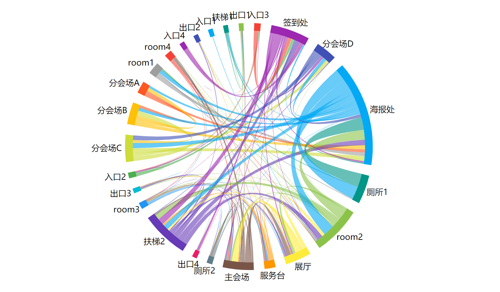

# Assignment 3

> 201605130098 16人工智能 李云开

最近再处理chinavis2019的数据，我最近的工作是处理时序事件的内在规律与模式。

## 数据：chinavis2019 的 day1 数据

chinavis提供的数据是设备的位置，以及每个人在每个设备的出现记录时间。

初始时，我在挖掘内在模式时没有对数据进行处理，在设备的纪律信息内寻找人员的移动规律。

在更大的层面上，关注人员的流动情况，我发现将设备转换为房间，可以大幅度减少人员移动规律的复杂程度。

## 可视化

在这个任务里，主要体现人员在各个房间内的走动情况

最初的选择是使用桑基图，但是发现库里对于复杂序列支持的不好，想到用环形的 Chord Diagram 关注两两元素 之间的关系

## Interactive Visualization

### 数据标记

对于每个数据进行提示，

### 数据形式

Chord Diagram 中的信息是有向的流入方向，所以需要区分流入与流出，默认关系的颜色与 源点 颜色相同

### 关注自己想要的

对于自己不想关注的节点，可以单击关闭与该节点连接的关系

## github：https://cherrybruin.github.io/chinavis2019/

## preview

